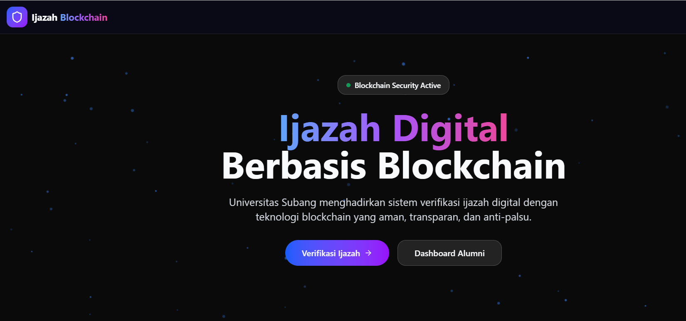
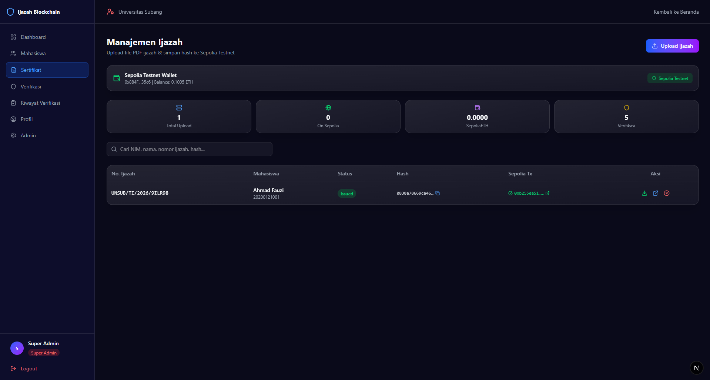
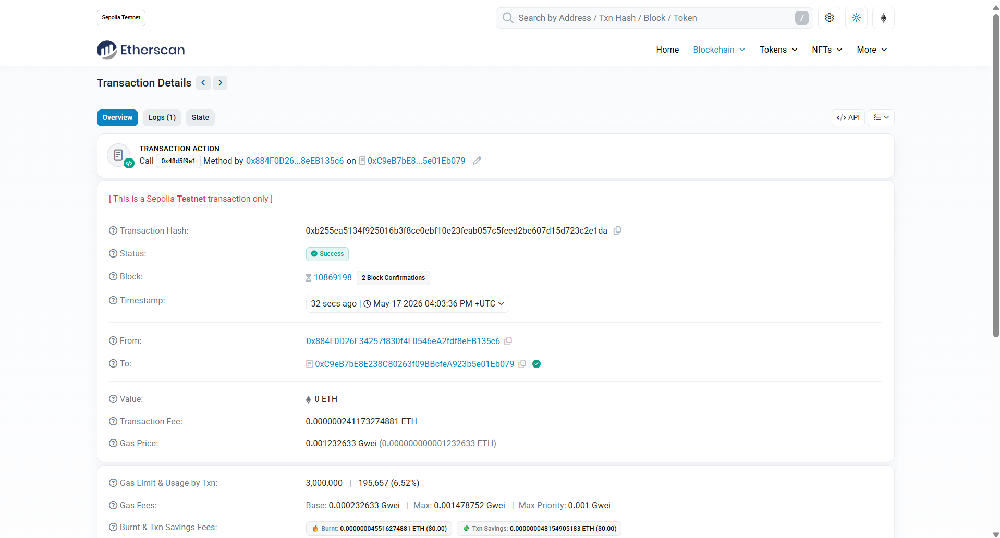
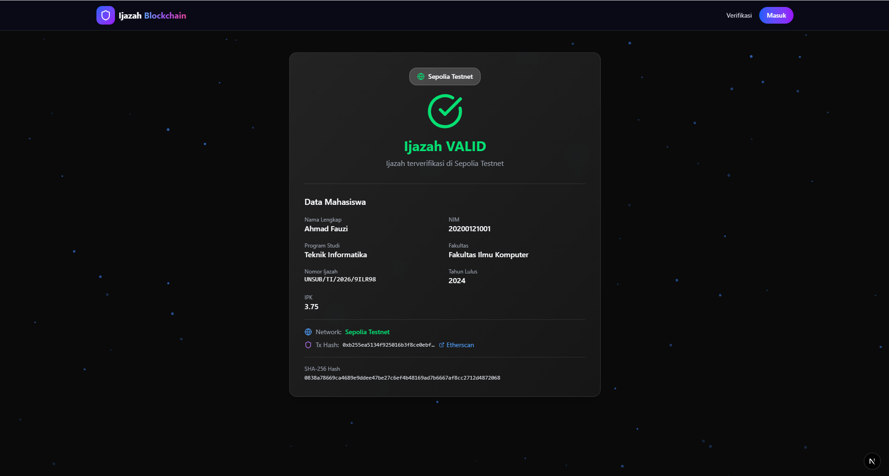

<p align="center">
  
  
  
  
  
  
</p>

<h1 align="center">🎓 Ijazah Digital Berbasis Blockchain</h1>
<h3 align="center">Blockchain-Based Digital Diploma Verification System</h3>
<h4 align="center">Universitas Subang (UNSUB) — Sepolia Testnet</h4>

<p align="center">
  Sistem modern untuk penerbitan, penyimpanan, dan verifikasi ijazah digital berbasis teknologi blockchain Ethereum (Sepolia Testnet).
  Dibangun dengan arsitektur full-stack: <strong>Next.js 16 + Laravel 13 + MySQL + Ethereum Smart Contract</strong>.
</p>

<br>

---

## 📋 Daftar Isi

- [Tentang Proyek](#-tentang-proyek)
- [Fitur Utama](#-fitur-utama)
- [Preview Sistem](#-preview-sistem)
- [Flow Sistem](#-flow-sistem)
- [Teknologi](#-teknologi)
- [Struktur Proyek](#-struktur-proyek)
- [Prasyarat](#-prasyarat)
- [Instalasi Backend](#-instalasi-backend)
- [Instalasi Frontend](#-instalasi-frontend)
- [Deploy Smart Contract](#-deploy-smart-contract)
- [Konfigurasi Blockchain](#-konfigurasi-blockchain)
- [API Endpoints](#-api-endpoints)
- [Akun Demo](#-akun-demo)
- [Keamanan](#-keamanan)
- [Developer](#-developer)
- [Lisensi](#-lisensi)

---

## 🎯 Tentang Proyek

**Ijazah Digital Berbasis Blockchain** adalah sistem digitalisasi ijazah yang dikembangkan untuk **Universitas Subang (UNSUB)**. Sistem ini memungkinkan institusi pendidikan untuk menerbitkan, menyimpan, dan memverifikasi ijazah secara **aman, transparan, dan anti-pemalsuan** dengan memanfaatkan teknologi blockchain Ethereum.

### Mengapa Blockchain?

| Masalah | Solusi |
|---------|--------|
| Pemalsuan ijazah | Hash SHA-256 disimpan di blockchain (immutable) |
| Verifikasi manual & lambat | Verifikasi instan via hash/QR code/file upload |
| Data bisa diubah | Blockchain menjamin integritas data |
| Tidak transparan | Publik bisa verifikasi kapan saja |

### ⚠️ PENTING: TESTNET, BUKAN MAINNET!

| Aspek | Detail |
|-------|--------|
| **Network** | Sepolia Testnet (Chain ID: `11155111`) |
| **Gas Fee** | SepoliaETH gratis dari faucet |
| **Biaya** | Tidak ada uang sungguhan yang digunakan |
| **Production** | Deploy ulang ke Ethereum Mainnet (Chain ID: `1`) |
| **Explorer** | [https://sepolia.etherscan.io](https://sepolia.etherscan.io) |

---

## ✨ Fitur Utama

### 📄 Manajemen Ijazah Digital
- Pengelolaan data mahasiswa & ijazah
- Generate hash SHA-256 otomatis
- Generate PDF ijazah (DomPDF)
- Generate QR Code verifikasi

### ⛓️ Integrasi Blockchain Ethereum
- Penyimpanan hash ijazah ke smart contract (Sepolia Testnet)
- Verifikasi hash on-chain
- Revoke sertifikat di blockchain
- Dukungan Mock Mode untuk development

### 🔍 Verifikasi Publik (3 Metode)
| Metode | Cara Kerja |
|--------|-----------|
| **Via Hash** | Masukkan SHA-256 hash (64 karakter hex) |
| **Via File** | Upload PDF ijazah, auto-hash & verifikasi |
| **Via QR Code** | Scan QR pada PDF → redirect ke halaman verifikasi |

### 👥 Role-Based Access Control
| Role | Akses |
|------|-------|
| **Super Admin** | Akses penuh, manajemen user |
| **Admin Akademik** | Manajemen mahasiswa & ijazah |
| **Verifikator** | Lihat log verifikasi |
| **Mahasiswa** | Lihat profil & status ijazah sendiri |

### 📊 Dashboard & Monitoring
- Statistik real-time (total alumni, ijazah terbit, verifikasi)
- Grafik interaktif (Recharts)
- Audit trail aktivitas pengguna
- Riwayat transaksi blockchain

---

## 📸 Preview Sistem

<table>
  <tr>
    <td align="center" width="50%">
      
      <br>
      <em>🏠 Halaman Awal — Landing Page</em>
    </td>
    <td align="center" width="50%">
      
      <br>
      <em>📜 Manajemen Sertifikat — Admin Dashboard</em>
    </td>
  </tr>
  <tr>
    <td align="center" width="50%">
      
      <br>
      <em>⛓️ Sepolia Testnet — Transaksi Blockchain</em>
    </td>
    <td align="center" width="50%">
      
      <br>
      <em>✅ Hasil Validasi — Verifikasi Ijazah</em>
    </td>
  </tr>
</table>

---

## 🔄 Flow Sistem

```
                    ┌─────────────────────────────────────────────────────────┐
                    │                    SISTEM IJAZAH DIGITAL                │
                    │                   BERBASIS BLOCKCHAIN                  │
                    └─────────────────────────────────────────────────────────┘

  ┌──────────┐    ┌──────────────┐    ┌─────────────────┐    ┌──────────────┐
  │ MAHASISWA│───>│ ADMIN INPUT  │───>│ GENERATE IJAZAH │───>│ DRAFT (Lokal)│
  │ (Lulus)  │    │ Data/Ijazah  │    │ (Hash + QR)     │    │              │
  └──────────┘    └──────────────┘    └─────────────────┘    └──────┬───────┘
                                                                    │
                                                                    v
                                                          ┌─────────────────┐
                                                          │ PUBLISH KE      │
                                                          │ BLOCKCHAIN      │
                                                          │ (Sepolia Testnet)│
                                                          └────────┬────────┘
                                                                   │
                                          ┌────────────────────────┼────────────────────────┐
                                          v                        v                        v
                                   ┌─────────────┐         ┌──────────────┐        ┌──────────────┐
                                   │ HASH ON-CHAIN│         │ GENERATE PDF │        │ QR CODE      │
                                   │ (Immutable)  │         │ (DomPDF)     │        │ (Verifikasi)  │
                                   └─────────────┘         └──────────────┘        └──────────────┘
                                                                                        │
                                                                                        v
                                   ┌─────────────┐         ┌──────────────┐        ┌──────────────┐
                                   │ VERIFIKASI  │<────────│ SCAN QR CODE │<───────│ DOWNLOAD PDF │
                                   │ (3 Metode)  │         │ / Upload PDF │        │ (Alumni)      │
                                   └─────────────┘         └──────────────┘        └──────────────┘
                                          │
                                          v
                                   ┌─────────────────────────────────────────────────┐
                                   │            HASIL: VALID / REVOKED              │
                                   └─────────────────────────────────────────────────┘
```

### Detail Alur:

1. **Upload** — Admin upload data mahasiswa & file PDF ijazah yang sudah ada
2. **Hash** — Sistem auto-hitung SHA-256 hash dari data/file PDF
3. **Blockchain** — Hash + metadata disimpan ke smart contract di Sepolia Testnet
4. **QR Code** — Generate QR berisi link verifikasi (tertanam di PDF)
5. **Verifikasi** — Publik bisa verifikasi via Hash / Upload PDF / Scan QR
6. **Pencocokan** — Hash dicocokkan dengan data di blockchain

---

## 🛠️ Teknologi

### Frontend

| Teknologi | Versi | Fungsi |
|-----------|-------|--------|
| Next.js | 16.2.6 | Framework React full-stack (App Router) |
| React | 19.2.4 | Library UI |
| TypeScript | 5.x | Type safety |
| Tailwind CSS | 4.x | Utility-first styling |
| Framer Motion | 12.38.0 | Animasi UI |
| GSAP | 3.15.0 | Advanced animations |
| Three.js / R3F | 0.184.0 | 3D rendering |
| TanStack React Query | 5.100.9 | Server state management |
| Axios | 1.16.0 | HTTP client |
| React Hook Form | 7.75.0 | Form handling |
| Zod | 4.4.3 | Validasi form |
| Recharts | 3.8.1 | Chart & diagram |
| Lucide React | 1.14.0 | Icon library |
| Radix UI | — | Komponen UI aksesibel |

### Backend

| Teknologi | Versi | Fungsi |
|-----------|-------|--------|
| PHP | ^8.3 | Bahasa pemrograman |
| Laravel | 13.x | Framework MVC |
| Laravel Sanctum | 4.3 | API authentication (token) |
| Spatie Permission | 7.4 | RBAC |
| Laravel DomPDF | 3.1 | Generate PDF |
| Endroid QR Code | 6.1 | Generate QR Code |
| web3p/web3.php | 0.1.6 | Ethereum JSON-RPC client |

### Database

| Teknologi | Versi |
|-----------|-------|
| MySQL | 8.0+ |

### Blockchain & Smart Contract

| Aspek | Detail |
|-------|--------|
| **Blockchain** | Ethereum |
| **Testnet** | Sepolia (Chain ID: `11155111`) |
| **Mainnet** | Ethereum (Chain ID: `1`) |
| **Smart Contract** | `IjazahStorage.sol` & `CertificateRegistry.sol` |
| **Library Backend** | web3p/web3.php (JSON-RPC) |
| **Library Frontend** | ethers.js v6 (MetaMask) |
| **Mock Mode** | Tersedia untuk development |
| **Block Explorer** | [Sepolia Etherscan](https://sepolia.etherscan.io) |

---

## 📂 Struktur Proyek

```
ijazah-blockchain-unsub/
│
├── contracts/                         # Smart Contracts (Solidity)
│   ├── IjazahStorage.sol              # Kontrak utama (^0.8.19)
│   └── CertificateRegistry.sol        # Kontrak alternatif (^0.8.20)
│
├── backend/                           # Laravel 13 REST API
│   ├── app/
│   │   ├── Http/Controllers/API/
│   │   │   ├── AuthController.php
│   │   │   ├── CertificateController.php
│   │   │   ├── VerificationController.php
│   │   │   ├── DashboardController.php
│   │   │   ├── MahasiswaController.php
│   │   │   └── AdminController.php
│   │   ├── Models/
│   │   │   ├── User.php
│   │   │   ├── Mahasiswa.php
│   │   │   ├── Ijazah.php
│   │   │   ├── Fakultas.php
│   │   │   ├── Prodi.php
│   │   │   ├── BlockchainTransaction.php
│   │   │   ├── VerificationLog.php
│   │   │   └── ActivityLog.php
│   │   └── Services/
│   │       ├── CertificateService.php
│   │       └── BlockchainService.php
│   ├── routes/api.php
│   ├── database/schema.sql
│   └── resources/views/certificates/ijazah.blade.php
│
├── frontend/                          # Next.js 16 App
│   ├── app/
│   │   ├── page.tsx                   # Landing page
│   │   ├── login/page.tsx
│   │   ├── verify/page.tsx
│   │   ├── verify/[hash]/page.tsx
│   │   └── dashboard/
│   │       ├── page.tsx
│   │       ├── mahasiswa/
│   │       ├── sertifikat/
│   │       ├── verifikasi/
│   │       ├── riwayat/
│   │       └── admin/
│   ├── components/
│   └── hooks/
│       └── useWallet.ts               # MetaMask wallet hook
│
├── database/
│   └── schema.sql
│
├── docs/                              # Dokumentasi
├── foto/                              # Screenshots
│   ├── page_awal.png
│   ├── sertifikat_diadmin.png
│   ├── testnet_eth.png
│   └── validasi_hasil.png
│
├── dokumen.txt                        # Dokumentasi sistem lengkap
└── README.md
```

---

## 📋 Prasyarat

Sebelum memulai instalasi, pastikan software berikut sudah terinstall:

| Software | Versi Minimal |
|----------|--------------|
| PHP | ^8.3 |
| Composer | Latest |
| Node.js | ^18 / 20+ |
| NPM | Latest |
| MySQL | 8.0+ |
| Git | Latest |
| MetaMask | Browser Extension |
| Foundry (opsional) | Latest |

---

## 🔧 Instalasi Backend

### 1. Clone Repository

```bash
git clone https://github.com/muadzie/IJASAH-BLOCKCHAIN.git
cd ijazah-blockchain-unsub
```

### 2. Setup Backend

```bash
cd backend
composer install
cp .env.example .env
```

### 3. Konfigurasi Database

Edit file `.env`:

```env
DB_CONNECTION=mysql
DB_HOST=127.0.0.1
DB_PORT=3306
DB_DATABASE=ijazah_blockchain
DB_USERNAME=root
DB_PASSWORD=
```

### 4. Generate Key & Migrate

```bash
php artisan key:generate
php artisan migrate --seed
php artisan storage:link
```

### 5. Jalankan Backend Server

```bash
php artisan serve
```

Backend akan berjalan di `http://localhost:8000`.

---

## 💻 Instalasi Frontend

### 1. Setup Frontend

```bash
cd frontend
cp .env.example .env.local
npm install
```

Edit `.env.local`:

```env
NEXT_PUBLIC_API_URL=http://localhost:8000/api
```

### 2. Jalankan Frontend

```bash
npm run dev
```

Frontend akan berjalan di `http://localhost:3000`.

---

## ⛓️ Deploy Smart Contract ke Sepolia

### 1. Install Foundry

```bash
# Install Foundry (https://book.getfoundry.sh)
curl -L https://foundry.paradigm.xyz | bash
foundryup
```

### 2. Dapatkan SepoliaETH (Gratis)

| Faucet | URL |
|--------|-----|
| Alchemy | https://sepoliafaucet.com |
| QuickNode | https://faucet.quicknode.com/ethereum/sepolia |
| PoW Faucet | https://sepolia-faucet.pk910.de |

### 3. Deploy Contract

```bash
forge create --rpc-url https://rpc.sepolia.org \
  --private-key YOUR_PRIVATE_KEY \
  contracts/IjazahStorage.sol:IjazahStorage
```

### 4. Update Environment

Setelah deploy, update `.env` backend dengan contract address:

```env
BLOCKCHAIN_RPC_URL=https://sepolia.infura.io/v3/YOUR_API_KEY
BLOCKCHAIN_CONTRACT_ADDRESS=0x_DEPLOYED_CONTRACT_ADDRESS
BLOCKCHAIN_MOCK_MODE=false
```

### 5. Verifikasi di Etherscan

```bash
forge verify-contract \
  --chain-id 11155111 \
  --etherscan-api-key YOUR_API_KEY \
  0x_DEPLOYED_CONTRACT_ADDRESS \
  contracts/IjazahStorage.sol:IjazahStorage
```

---

## ⚙️ Konfigurasi Blockchain

Untuk mode development, sistem menggunakan **Mock Mode** secara default. Mode ini men-generate transaction hash palsu tanpa perlu koneksi ke blockchain sungguhan.

Backend `.env`:

```env
# Mock Mode (development)
BLOCKCHAIN_MOCK_MODE=true

# Production (Sepolia Testnet)
# BLOCKCHAIN_MOCK_MODE=false
# BLOCKCHAIN_RPC_URL=https://sepolia.infura.io/v3/YOUR_API_KEY
# BLOCKCHAIN_CONTRACT_ADDRESS=0x...
# BLOCKCHAIN_NETWORK=sepolia
```

---

## 🌐 API Endpoints

### Public (Verifikasi via Sepolia Testnet)

| Method | Endpoint | Deskripsi |
|--------|----------|-----------|
| `POST` | `/api/verify/hash` | Verifikasi hash ke smart contract |
| `POST` | `/api/verify/file` | Upload PDF, auto-hash, verifikasi |
| `GET` | `/api/verify/{hash}` | Verifikasi via URL (QR code) |
| `GET` | `/api/verify/stats` | Statistik verifikasi |
| `GET` | `/api/verify/etherscan/{txHash}` | Redirect ke Etherscan |

### Admin (Authenticated — Sanctum Token)

| Method | Endpoint | Deskripsi |
|--------|----------|-----------|
| `POST` | `/api/auth/login` | Login |
| `POST` | `/api/auth/logout` | Logout |
| `GET` | `/api/auth/me` | Profile |
| `POST` | `/api/ijazah` | Generate ijazah |
| `POST` | `/api/ijazah/upload` | Upload PDF + simpan hash ke Sepolia |
| `GET` | `/api/ijazah` | List ijazah |
| `GET` | `/api/ijazah/{id}` | Detail + link Etherscan |
| `POST` | `/api/ijazah/{id}/publish` | Publish ke blockchain |
| `POST` | `/api/ijazah/{id}/revoke` | Revoke di blockchain |
| `GET` | `/api/ijazah/blockchain/stats` | Statistik blockchain |
| `GET` | `/api/ijazah/blockchain/balance` | Cek balance SepoliaETH |
| CRUD | `/api/mahasiswa` | Manajemen mahasiswa |

---

## 👤 Akun Demo

| Role | Email | Password |
|------|-------|----------|
| **Super Admin** | `admin@unsub.ac.id` | `admin123` |

---

## 🔐 Keamanan

| Aspek | Implementasi |
|-------|-------------|
| **Password** | bcrypt hashing |
| **API Auth** | Laravel Sanctum (token-based) |
| **CORS** | Terbatas ke frontend URL |
| **Input Validation** | Form Request / Validator |
| **SQL Injection** | Eloquent ORM (parameter binding) |
| **XSS** | Blade escaping |
| **Blockchain** | Data immutable, hash verification |
| **Audit Trail** | Semua aktivitas tercatat |

---

## 👨‍💻 Developer

<table>
  <tr>
    <td align="center">
      <strong>Ilham Mu'adz Fakhrizi</strong><br>
      Full-Stack Developer & Blockchain Enthusiast<br>
      Universitas Subang (UNSUB)
    </td>
  </tr>
</table>

| Kontak | Info |
|--------|------|
| 📧 Email | [ilhammuadz133@gmail.com](mailto:ilhammuadz133@gmail.com) |
| 🐙 GitHub | [@muadzie](https://github.com/muadzie) |

---

## 📄 Lisensi

Hak Cipta © 2026 **Ilham Mu'adz Fakhrizi**

Seluruh hak cipta dilindungi undang-undang.
Dilarang menyalin, mendistribusikan, atau memodifikasi sebagian maupun seluruh kode sumber aplikasi tanpa izin tertulis dari pengembang.

---

## ⭐ Dukungan

Jika proyek ini membantu, silakan dukung dengan:

- 🌟 **Star** Repository
- 🍴 **Fork** Project
- 🛠️ **Contribution** & Feedback
- 📢 **Share** ke yang membutuhkan

---

<p align="center">
  <sub>Built with ❤️ for Universitas Subang (UNSUB)</sub>
  <br>
  <sub>© 2026 Ilham Mu'adz Fakhrizi. All rights reserved.</sub>
</p>
